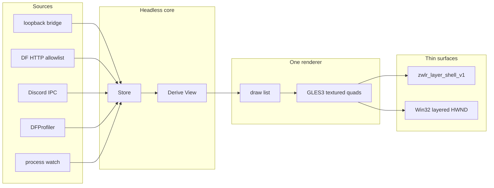
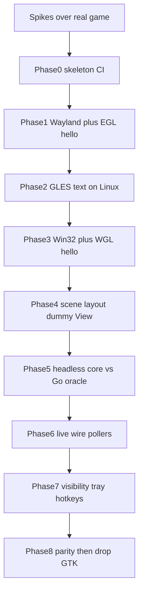

# Rewrite df-hud as one GPU overlay

The current project is a strong **data plane** glued to two **unrelated UI stacks**. Linux pays for GTK4 (Cairo/Pango, CGO, 58MB binary, gtk4-layer-shell load-order hazards). Windows pays for a full 2D game engine ([Ebitengine](internal/hud/ebiten/frontend_windows.go)) to draw text at 10 Hz. The portable draw list in [`internal/hud/scene`](internal/hud/scene/scene.go) is the right idea, but only Windows uses it.

If rewriting with no legacy constraints, the HUD is not an application toolkit problem. It is: one alpha surface, click-through, GPU textured quads, ~10 dirty frames per second.



## What to keep (do not reinvent)

These are already the correct product architecture:

- **No game-memory reads.** Process watch is existence/uptime only ([`internal/game`](internal/game/game.go)).
- **Loopback userscript bridge** for credentials ([`internal/bridge`](internal/bridge/bridge.go)).
- **Allowlisted DF client** + process-wide 1s rate gate ([`internal/dfclient`](internal/dfclient/dfclient.go), [`internal/rategate`](internal/rategate/rategate.go)).
- **Discord IPC as a fake endpoint**, presence position winning over polled coords in `Derive` ([`internal/store/store.go`](internal/store/store.go) around the presence override).
- **`Derive(now)` is pure** — UI ticks recompute countdowns with no I/O.
- **Fail-open visibility** ([`internal/visibility`](internal/visibility/visibility.go)): wrongly shown beats wrongly invisible.
- **Full-monitor surface + screenshot coordinates** in a 2560×1440 authoring space. Independent per-group `x`/`y`.
- **Click-through + no keyboard**: empty `wl_region` / `WS_EX_TRANSPARENT`; layer-shell `keyboard_interactivity = none`.
- **Exclusive zone `-1`**, layer `overlay`, namespace for compositor rules.
- Headless flags (`-print-view`, `-once`, `-check-config`). Same binary, GPU skipped.

Target: roughly **12–18k LOC** vs ~29k today, **~3–6MB binaries**, idle RSS dominated by the GL driver rather than GTK/GLFW.

## Spikes before the rewrite (kill the stack here, not in month three)

Phases 1–8 are the product. **Do not start them until throwaway programs work over Dead Frontier itself.** Keep the Go HUD installed. Spikes are ~200–400 lines, C or a throwaway Rust bin under `tools/`, deleted after. [`tools/windows-overlay-spike`](tools/windows-overlay-spike) only proves **Ebitengine/GLFW**. It does not prove raw WGL, which is what the rewrite uses.

Test on the GPU and compositor you actually play on (Hyprland + your NVIDIA/AMD/Mesa driver). Wine is not a DWM proof. A terminal behind the overlay is not a fullscreen-Unity proof.

### Must-pass (fail = pick a different overlay stack, do not port `Derive`)

1. **EGL on `zwlr_layer_shell_v1`, not xdg-shell.** Translucent GLES 3.0 clear + one rect, layer `overlay`, exclusive zone `-1`, keyboard none. Waybar-style samples use `wl_shm` (CPU). The unknown is Mesa/NVIDIA `eglCreateWindowSurface` on a *layer* surface. **Done when:** `hyprctl layers` shows the namespace; the tint sits **over the running fullscreen game**.

2. **Click-through after `eglSwapBuffers`.** Empty `wl_region` as input region, then swap every frame for 30s. GTK overwrites the region on map ([`layershell.go`](internal/hud/gtk/layershell.go)); EGL/Mesa may commit and do the same. **Done when:** every click and mouse-look still hits the game. Re-apply the region on every `configure` if needed — that is an acceptable product fix; *unable* to keep it empty is a kill.

3. **Raw WGL overlay without GLFW.** `WS_EX_LAYERED | WS_EX_TRANSPARENT | WS_EX_TOPMOST | WS_EX_NOACTIVATE | WS_EX_TOOLWINDOW`, GL 3.3, alpha pixel format, 1px inset ([`window_windows.go`](internal/hud/ebiten/window_windows.go) `windowInset = 1`). **Done when:** native Windows (not Wine) shows a translucent click-through rect over the game; DWM does not punch an opaque hole.

4. **Unity presentation mode.** Same spikes over the game in **borderless / fullscreen** as you actually play. Exclusive fullscreen on Windows can hide every overlay; if that is how you play and WGL cannot show, the rewrite cannot either — confirm before writing 15k lines. Linux: `hud.layer = overlay` is required; `top` is invisible under fullscreen ([`config.go`](internal/config/config.go)).

5. **Do not vsync-wait against the game.** `eglSwapInterval(0)` / `wglSwapIntervalEXT(0)`, present only when dirty. **Done when:** walking around in-game with the spike swapping at 1 Hz feels like no overlay; interval 1 (blocking) is allowed to fail this test.

### Should-pass (fail = design tweak, not abandon)

6. **Premultiplied alpha.** Wayland compositors blend premult. Straight RGBA outlines get dark fringes. Spike: white text, 8-neighbor black outline, on the game. If fringed, the shader outputs premult (`rgb * a`).

7. **Fractional scale.** Hyprland 125% and 150% with `wp_fractional_scale_v1` + `wp_viewporter` (or buffer scale). Spike a 1px grid. Blurry = you are drawing at the wrong size. Do this in the Linux spike, not after fonts look “good enough” at 100%.

8. **Subpixel font filtering.** RGB subpixel AA on a *transparent* overlay looks like color fringing. Spike grayscale/alpha atlas only.

9. **Unmap / remap.** Hide the layer surface for 5s (workspace switch), show again, EGL context still valid, click-through still on.

10. **Output pin.** Two monitors: surface on the game’s `wl_output` only, not cloned to the desktop output.

11. **`cargo zigbuild` Windows exe actually loads `opengl32` on a real Windows box.** Cross-compile success is not a GL proof.

### Known gotchas (do not rediscover; do not spike forever)

- **Proton Discord IPC** is an ops bridge inside the game wineserver, not something EGL solves. Documented in [`knowledge/presence.md`](knowledge/presence.md). Do not block the overlay rewrite on it; the Go presence server is the spec.
- **Binding `discord-ipc-0` while Discord is running** — one listener wins. Spike optional; product already chose to *be* the endpoint.
- **NVIDIA proprietary + Wayland EGL** used to be the janky path vs Mesa. If spike 1 fails only on NVIDIA, that is a driver/EGL platform issue (`EGL_KHR_platform_wayland`), not a reason to bring back GTK.
- **Hyprland layer rules / blur** on the namespace can make a “transparent” GL buffer look milky. Test with rules off, then with [`contrib/df-hud.lua`](contrib/df-hud.lua) rules on.
- **Letterbox:** Unity registry on Windows already exists; Linux spike can ignore it until Phase 4.

**Kill criteria:** if spikes 1–4 fail on the machine you play on, stop. Alternatives (wl_shm CPU, keep GTK, keep Ebitengine on Windows only) are then honest — not a surprise after the core port.

## Handoff (2026-08-23) — Phase 3 dummy text passed over the game, Phase 4 is next (not started)

**Do not re-spike. Do not start Phase 5.** When resuming, implement Phase 4 in the product crate at the repo root — not `tools/*-overlay-spike`. Keep the Go `df-hud` installed until Phase 8. Do not copy `internal/hud/gtk` or `internal/hud/ebiten`. Font look is parked (Bold + LINEAR + 1px atlas outline is “okay, not final”; 1200p vs 1440p raster size looks different).

Branch: `spike/wgl-overlay`.

### Where Phase 3 landed

Product crate (one `Gpu`, two surfaces):

| File | Owns |
|---|---|
| [`src/wayland.rs`](src/wayland.rs) | layer-shell, `GlWindow` (EGL + `eglSwapBuffers`), fd + 1s poll, remap |
| [`src/egl.rs`](src/egl.rs) | `libloading` EGL 1.5 / GLES **3.0** (not 3.2) |
| [`src/win32.rs`](src/win32.rs) | layered HWND, Intel DWM recipe, PerMonitorV2, `MsgWaitForMultipleObjects` + 1s, `--unmap-at` |
| [`src/wgl.rs`](src/wgl.rs) | dummy-context WGL 3.3 core, alpha 8, `wglSwapIntervalEXT(0)`. Dummy class `df-hud-wgl-dummy` (not overlay class `df-hud`) |
| [`src/gpu.rs`](src/gpu.rs) | shader + VAO + atlas + draw list. **No `WlSurface` / HWND.** GLSL version string is the only `cfg` |
| [`src/font.rs`](src/font.rs) | fontdue + atlas pack + 1px dilated outline (all targets) |
| [`src/dummy.rs`](src/dummy.rs) | hardcoded groups + local clock (both OS) |
| [`assets/fonts/Go-Mono-Bold.ttf`](assets/fonts/Go-Mono-Bold.ttf) | one bundled TTF (`include_bytes!`) |

`glow` + `libloading` are shared deps. `windows-sys` **0.61.2** (not 0.59): `BOOL` lives in `windows_sys::core`, not `Foundation`. Kitchen-sink `windows` crate is banned. CI ([`.github/workflows/rust.yml`](.github/workflows/rust.yml)) requires fontdue/glow/libloading/windows-sys on windows-gnu; still rejects wayland/gtk/tokio/winit/wgpu/khronos-egl. Linker: [`.cargo/config.toml`](.cargo/config.toml) (`x86_64-w64-mingw32-gcc`). `.gitignore` uses `/config.toml`.

Shader (keep): Linux `#version 300 es`, Windows `#version 330 core`, same body. `gl_Position = vec4(clip.x, -clip.y, 0, 1)`, `frag = vec4(rgb * a, a)`, blend `ONE, ONE_MINUS_SRC_ALPHA`, atlas R coverage, **LINEAR**. Outline is a dilated 1px ring (two quads).

Font size: `FONT_PT = 12` × `4/3` → 16px at 2560×1440. Dummy coords from example.toml: status `(10,10)` `#e6cc4d`, session `(350,60)` `IC Time:` ticking, xp `(220,85)`, block `(2340,300)` `#9ecbff`. Scale with `logical_h / 1440`.

Windows loop: `MsgWaitForMultipleObjects` + 1s; swap only if dirty/clock changed; reassert `WS_EX_*` each present. Flags: `--monitor`, `--list-monitors`, `--duration`, `--unmap-at`.

Native rust-mingw `dlltool` on the Windows play box **cannot** build (GNU 2.44 `CreateProcess` — no `as.exe` in rust-mingw `self-contained`). Cross from Linux/Docker (`df-hud-rs` image, same MinGW as CI). Do not chase native gnu `dlltool`.

### Gate (player machines)

**Linux** (Phase 2, still required): Hyprland 0.56, RX 7900 XTX, Mesa, DP-1 2560×1440 100%. `cargo run --release -- --output DP-1`.

**Windows** (Phase 3, 2026-08-23): Unity 4.7.2 fullscreen=1 D3D9 `WS_POPUP` at 1920×1200. Go HUD off. Linux-cross gnu exe.

- Outlined dummy text over Dead Frontier; session second ticks.
- Click-through / mouse-look / WASD still hit the game after 1 Hz swaps.
- Window `1918x1198 at 1,1` inset 1; pixel format alpha 8; swap-interval 0.
- This product run: overlay GL on **RTX 4060** `3.3.0 NVIDIA` (spike had been Iris Xe; hybrid either way is fine).
- Fonts look a bit heavier/softer than Linux 1440p (~13px vs 16px raster). Parked.

### Phase 4 — do this

Port the *idea* of [`internal/hud/scene`](internal/hud/scene): groups, 2560×1440 authoring space, per-group `x`/`y`, map rects/lines. Hardcode a `View`. Stub TOML only (`serde` + `toml` are allowed). No network, no `Derive`.

**Done when:** moving `widget.block.x` in a stub TOML moves the block group; map draws; Linux and Windows **layout** look the same (not font hinting).

Concrete:

1. Draw list beyond `TextLine`: colored rects + lines (map cells, district lines, player ring). `Gpu` already has an untextured white texel. Do not write a second renderer / second shader.
2. Layout transform like [`layout.go`](internal/hud/scene/layout.go): reference 2560×1440 → content rect (letterbox later if game size is known; Linux can still ignore Unity registry). Independent `[widget.<group>]` `x`/`y`.
3. Stub TOML: enough of [`df-hud.example.toml`](df-hud.example.toml) `[widget.status|session|xp|block|map]` to move groups. Unknown keys = error (same as Go). `notify` is banned; stat the file on the 1s tick if you reload.
4. Hardcoded dummy `View` (clock still local). Map can be a tiny fake city grid, not the real `citymap.txt` (that is Phase 5).
5. Both surfaces consume the same scene. Dummy strings in `dummy.rs` go away as the scene feed.

### Must keep (do not rediscover)

- Wayland remap after `attach(null)`: empty commit → wait for `configure` → `ack_configure` in the **same** commit as `eglSwapBuffers`. Never ack with no buffer.
- Product HWND: `SetLayeredWindowAttributes(hwnd, 0, 255, LWA_ALPHA)` **and** `DwmEnableBlurBehindWindow` with empty `CreateRectRgn(0,0,-1,-1)`. 1px inset. Dummy WGL class is **not** the overlay class.
- Premult `frag = vec4(rgb * a, a)`, blend `ONE, ONE_MINUS_SRC_ALPHA`, vertex Y flip. Grayscale atlas only.
- Cross-compile windows-gnu from Linux/Docker + MinGW. Do not add `windows-latest`.
- `windows-sys` 0.61: `BOOL` is `windows_sys::core::BOOL`.

### Do not

Port `Derive`, flsh/dfclient, network, tray, visibility/workspace follow (Phase 7), or delete GTK. Do not pull tokio/reqwest/wgpu/GTK/winit/khronos-egl. Do not restyle fonts as the Phase 4 gate. Do not invent a new layout language. Do not implement the console.

Test: same machines as Phase 2–3. Linux `cargo run --release -- --output DP-1`. Windows: cross-build, run the gnu exe over the game. Stub TOML `widget.block.x` change is visible on both.

### Gate results

| # | Gate | Result |
|---|---|---|
| 1 | EGL GLES 3 on `zwlr_layer_shell_v1` overlay, exclusive -1, over Proton `DeadFrontier.exe` `fs=2` | **Pass** (Hyprland 0.56.2, RX 7900 XTX, Mesa 26.1.8, DP-1 2560×1440 100%) |
| 2 | Click-through after `eglSwapBuffers` | **Pass** |
| 3 | Raw WGL layered HWND, no GLFW, GL 3.3, alpha 8, 1px inset | **Pass** (class `df-hud-wgl-spike`) |
| 4 | Overlay over the way they actually play | **Pass** Linux overlay-layer; **Pass** Windows Unity 4.7.2 fullscreen=1 D3D9 `WS_POPUP` |
| 5 | Swap interval 0 at 1 Hz while walking | **Pass** both. Windows interval 1 also fine. |
| 6 | Premult outlined text | **Pass** both |
| 7 | Fractional scale 125/150% 1px grid | **Not run** (Linux play is 100%) |
| 8 | No RGB subpixel AA | **Pass** by construction (5×7 grayscale bitmap) |
| 9 | Unmap/remap, context + click-through | **Pass** both (see gotchas) |
| 10 | Output pin | **Pass** Linux DP-1 only |
| 11 | zigbuild gnu exe loads `opengl32` | **Partial** — native Windows `cargo build --release` (gnu 1.98) is the GL proof. Linux-cross gnu prebuilt died after 1 swap until dummy-window fix; re-cross after that fix if you care. |

Kill Phase 0? **No.**

### Do not rediscover

**Linux** ([`tools/linux-overlay-spike`](tools/linux-overlay-spike)):

- Product client is `wayland-client` + `wayland-protocols-wlr`, not a C sample. Mesa still wants a libwayland `wl_surface*` → `wayland-backend` feature `client_system`. `khronos-egl` 6.0.0 did **not** compile on rustc 1.97; spike uses `libloading` (`src/egl.rs`).
- Never `ack_configure` until a buffer is attached in the same commit as `eglSwapBuffers`. Ack during `roundtrip` maps an empty surface (`hyprctl layers` shows it, grim/user see nothing).
- Vertex Y: y-down pixels → `gl_Position = vec4(clip.x, -clip.y, 0, 1)`. The opposite flip drew the HUD off the top of the screen.
- Layer-shell remap after `attach(null)`: Hyprland sets `m_configured = false`. Empty commit (re-apply anchor/exclusive/keyboard), wait for `configure`, ack, **then** swap. Swap first → `layerSurface was not configured, but a buffer was attached`.
- Unmap is one-shot. Clearing `remap_at` and testing `unmap_at` again immediately re-hides.
- Namespace `df-hud-spike` so [`contrib/df-hud.lua`](contrib/df-hud.lua) blur rules (`^(df-hud)$`) do not apply. Do not `pgrep -f DeadFrontier` (Discord/Firefox titles). Match `/proc` argv0 basename `DeadFrontier.exe`. Do not `pkill -f linux-overlay-spike` from a command line that contains that string.
- Full-output overlay is correct (visible over other windows on DP-1), not clipped to the Unity HWND.

**Windows** ([`tools/wgl-overlay-spike`](tools/wgl-overlay-spike), filled [`REPORT.md`](tools/wgl-overlay-spike/REPORT.md)):

- `tools/windows-overlay-spike` is Ebitengine/GLFW. Ignore it for the rewrite.
- `DwmExtendFrameIntoClientArea` **alone was invisible** on Intel Iris Xe. Need `SetLayeredWindowAttributes(hwnd, 0, 255, LWA_ALPHA)` **and** `DwmEnableBlurBehindWindow` with an **empty** region `CreateRectRgn(0,0,-1,-1)`. Constant 255 multiplies per-pixel alpha; it does not flatten it.
- Dummy WGL window shares the overlay class. `DestroyWindow` on it fired `WM_DESTROY` → process `CLOSED`. Call `clear_closed()` after dummy teardown (or use a distinct dummy class).
- Overlay GL ran on **iGPU** (Iris Xe 3.3.0); game on **RTX 4060** D3D9. That hybrid path worked. 1px inset expected.
- `--inset 0` hole test skipped. Borderless contrast not run; they play exclusive-style fullscreen.

**Shader:** premult `frag = vec4(rgb * a, a)`, blend `ONE, ONE_MINUS_SRC_ALPHA`. Same idea on both.

### Next work (Phase 4)

Scene/layout, still dummy data. Port the idea of [`internal/hud/scene`](internal/hud/scene): groups, 2560×1440, map rects/lines, stub TOML `widget.*.x/y`. Hardcode a `View`. **Done when:** moving `widget.block.x` moves the block group; map draws; Linux and Windows layout match.

Must keep from Phase 1–3 / spikes:

- Wayland remap after `attach(null)`: empty commit → configure → ack in the same commit as `eglSwapBuffers`. Never ack with no buffer.
- Product HWND: `SetLayeredWindowAttributes(..., 255, LWA_ALPHA)` **and** empty-region `DwmEnableBlurBehindWindow`. 1px inset. WGL dummy class ≠ overlay class.
- Premult `frag = vec4(rgb * a, a)`, blend `ONE, ONE_MINUS_SRC_ALPHA`, vertex Y flip. Grayscale atlas only.
- windows-gnu from Linux/Docker + MinGW. Native rust-mingw `dlltool` on the Windows play box is broken (no `as.exe`). `windows-sys` 0.61 `BOOL` is in `core`.

On Arch, pacman `rust` cannot cross-compile; rustup + `mingw-w64-gcc`. Do not add a `windows-latest` compile job. Do **not** port `Derive` or delete GTK until Phase 8.

Optional leftovers (not blocking): Linux `--grid` at 125/150%; font outline in em so 1200p matches 1440p; Hyprland blur with namespace `df-hud`.

## Build order (vertical slices, not layers)

The old todo list (port all of core, then both overlays, then GL) is how a rewrite gets lost: months of a faithful poller with no pixels, then a second UI stack. Do **one runnable slice per phase**. Do not start the next phase until the gate passes. Keep the current Go `df-hud` installed and playing the game until Phase 8. **Spikes 1–5 passed over real Dead Frontier (2026-08-23).** Phase 0–3 are in the product crate. Phase 4 is the next slice (not started).



Phase 5 can overlap Phase 2–4 if two people work: core is pure tests and does not need a GPU. One person still does 0→4 first — overlay compositing is the unknown; `Derive` is already specified in Go.

**Oracle rule:** the existing binary’s `-print-view`, `-dump-fields`, and `go test` fixtures are the spec. Port tests to Rust; do not re-derive DF protocol from memory. Do not port [`internal/hud/gtk`](internal/hud/gtk) or [`internal/hud/ebiten`](internal/hud/ebiten) at all.

**Do not, in any phase:** add tokio/reqwest/wgpu/GTK/winit; write a second renderer; implement the planned console; invent a new layout language; rewrite the userscript.

### Phase 0 — Skeleton

One crate, `src/main.rs` prints version. CI on Linux: `cargo build` linux-gnu and `cargo build --target x86_64-pc-windows-gnu` with apt MinGW. `panic=abort` in release. **Done when:** both artifacts exist in CI with zero GUI deps. **Done** (root crate + `.github/workflows/rust.yml`).

### Phase 1 — Wayland + EGL hello (hardest unique risk)

Layer-shell surface, four-edge anchor, exclusive zone -1, keyboard none, empty input region, EGL GLES 3.0, clear to `0,0,0,0` plus one translucent colored rect. No fonts. Remap after `attach(null)`: empty commit → configure → ack + swap in one commit (never ack with no buffer). **Done when:** on Hyprland, a tinted full-monitor overlay sits over the game (and over the desktop), mouse clicks land on the game, keys go to the game, `hyprctl layers` shows the namespace. **Done** (product crate; cyan rect visible on Hyprland).

### Phase 2 — Shared GLES text (Linux only)

One shader, VAO, bundled TTF via fontdue, atlas, outlined dummy strings at screenshot coords. Event loop: Wayland fd + 1s timer; no swap if nothing changed. **Done when:** outlined text is crisp on the layer surface at 1 Hz; RSS is in the “GL driver + tiny app” range, not GTK-sized. **Done** (product crate over the game; click-through held; font look parked).

### Phase 3 — Windows surface, same renderer

Plug the Phase 2 renderer into WGL on a layered HWND. Do not fork shaders. Intel DWM recipe is mandatory: `SetLayeredWindowAttributes(..., 255, LWA_ALPHA)` plus `DwmEnableBlurBehindWindow` with empty `CreateRectRgn(0,0,-1,-1)` — extend-frame alone was invisible on Iris Xe. **Done when:** the same dummy text appears click-through on native Windows (or Wine smoke for context create); DWM alpha works (that recipe + 1px inset); `cargo build --target x86_64-pc-windows-gnu` still produces the exe from Linux.

### Phase 4 — Scene / layout, still dummy data

Port the *idea* of [`internal/hud/scene`](internal/hud/scene): groups, reference 2560×1440, map rects/lines. Hardcode a `View`. **Done when:** moving `widget.block.x` in a stub TOML moves the block group; map draws; Linux and Windows look the same.

### Phase 5 — Headless core vs Go oracle

Order inside this phase (each with unit tests before the next):

1. Flsh parse + allowlisted `dfclient` (forbidden endpoints test like today)
2. `Store` + `Derive(now)` (presence wins for position)
3. Config TOML (unknown keys = error)
4. Citymap / XP catalog types (embed `citymap.txt`)
5. CLI `-print-view` / `-check-config` with no GPU

**Done when:** Rust `-print-view` on a saved fixture matches Go `-print-view` on the same fixture. No live network required for the gate.

### Phase 6 — Live data into the renderer

Threads: rate-gated pollers, Discord IPC, loopback bridge, catalog/bossmap. Main thread: `Derive` → scene → GLES on timer/dirty. **Done when:** with the existing userscript, a real session shows block/XP/challenges/map on the GPU overlay. Visibility may still be “always on.”

### Phase 7 — Desktop behavior

Process watch; fail-open visibility; foreign-toplevel (Hyprland IPC fallback); unmap when hidden; tray; Windows `RegisterHotKey` while focused; HTTP actions (keep contrib Lua working). **Done when:** HUD hides with the game/workspace like today; tray toggle and `POST /api/overlay/toggle` agree.

### Phase 8 — Parity, then delete the old UI

Fractional-scale + viewporter; Proton IPC path; systemd/install; default TOML compatible with [`df-hud.example.toml`](df-hud.example.toml) keys that still exist. Walk the current README feature list. **Done when:** you can uninstall GTK from the build and ship Linux+Windows from the Linux runner. Console stays out of scope.

**If a phase slips:** cut scope inside that phase (e.g. skip portal shortcuts, keep HTTP+Lua). Do not start Phase 6 while Phase 1 still fails click-through — that is how the rewrite becomes two half-apps.

## Language: Rust, one crate

Go’s runtime is a ~10MB floor and the GC does not help a mostly-idle overlay. Zig would be smaller still, but HTTP/TLS/TOML/Wayland would slide into the “write it all” zone you want to avoid.

Rust hits the requested middle:

- Cross-compile both targets from Linux: `cargo build --release` and `cargo build --release --target x86_64-pc-windows-gnu` (MinGW). Not zigbuild unless C deps appear; not `windows-latest` for compile.
- Linux overlay via **`wayland-client` + `wayland-protocols-wlr`** (Rust protocol impl, **no libwayland, no GTK, no gtk4-layer-shell**).
- Windows via **`windows-sys`** feature-gated to windowing/GDI/DPI — not the kitchen-sink `windows` crate.
- No tokio. Polling is 10s; **std threads + channels**, same shape as today’s goroutines.

Keep it **one crate with `src/` modules**. A workspace of four crates would be ceremony at this size.

## Overlay surfaces (the only real platform code)

Do not use GLFW, SDL, winit, GTK, or Ebitengine. None of them speak `zwlr_layer_shell_v1` without a second toolkit on top.

**Linux (~400–600 LOC)** — talk to the protocol, not to gtk4-layer-shell:

1. Bind `wl_compositor`, `wl_output`, `zxdg_output_manager_v1` (connector names like `DP-1`), `zwlr_layer_shell_v1`.
2. `get_layer_surface` on a `wl_surface`: layer overlay, anchor all four edges, `exclusive_zone = -1`, `keyboard_interactivity = none`.
3. Pin to a `wl_output` (config `hud.monitor` or follow the game’s output).
4. Empty input region every configure (GTK’s silent overwrite problem goes away because you own the surface).
5. **Fractional scale from day one:** `wp_fractional_scale_v1` + `wp_viewporter`. Raw clients that skip this look blurry on Hyprland 125/150%; GTK was hiding that cost.
6. Hide by **destroying or unmapping** the layer surface when visibility says off — do not leave a full-screen transparent surface up.

GPU attach: `wl_egl_window` + EGL + **GLES 3.0** (`libEGL.so.1`, `libGLESv2.so.2` loaded at runtime; request `EGL_CONTEXT_CLIENT_VERSION` 3). No compile-time GTK/EGL linking required if you use `libloading`. This is a real GPU context on the layer surface, not Cairo.

**Windows (~400–600 LOC)** — skip GLFW’s `GLFW30` class and the multi-tick `SetMonitor` dance in [`window_windows.go`](internal/hud/ebiten/window_windows.go):

- `CreateWindowEx` with `WS_POPUP` and `WS_EX_LAYERED | WS_EX_TRANSPARENT | WS_EX_TOPMOST | WS_EX_TOOLWINDOW | WS_EX_NOACTIVATE`.
- WGL context on that HWND (`wglCreateContextAttribsARB`, OpenGL **3.3 core**) with an alpha pixel format; load `opengl32.dll` at runtime. Same GLSL 300/330 shader as Linux — one `glow` profile, no GLES2 extension soup.
- Keep the proven **1px inset** so DWM does not discard the transparent framebuffer.
- Manifest `PerMonitorV2` as today.
- Size to the logical monitor rect; `SetWindowPos` onto the target `HMONITOR` in one step.
- Reassert passthrough after monitor changes (Ebitengine taught this lesson).

Both surfaces expose the same trait: `resize`, `make_current`, `swap`, `set_visible`, `set_monitor`. The renderer never sees Wayland or HWND.

## GPU on both Linux and Windows

Yes — both builds draw with the GPU. There is no CPU/Cairo fallback in the HUD path.

- **Linux today:** GTK4 labels via Pango/Cairo. The compositor may texture that buffer, but df-hud itself is not issuing GL draws. The rewrite attaches EGL to the layer-shell `wl_surface` and issues the same textured-quad draws as Windows.
- **Windows today:** already GPU (Ebitengine OpenGL). The rewrite keeps GPU, drops the game engine, and uses WGL on the HWND we own.
- **Shared code:** one shader, one font atlas, one draw list. Platform code only creates the context (`eglCreateWindowSurface` vs `wglCreateContext`) and presents (`eglSwapBuffers` vs `SwapBuffers`).
- **Not wgpu, not D3D11-only, not Vulkan.** GLES 3.0 / GL 3.3 is enough for this HUD, loads from the system (`libGLESv2` / `opengl32`), and cross-compiles without a GPU SDK. D3D11 would be more “native Windows” but would split the renderer in two; Unity already runs fine under a transparent GL overlay.

Headless CLI flags still skip GPU entirely (`-print-view`, `-once`, …).

## Why GLES 3.0, not 2.0 (support, security, maintenance)

Same two system libraries either way. 2 vs 3 is not extra crates, not extra binary size, not a different security boundary.

- **Security:** You do not vendor GLES. Mesa/NVIDIA/AMD/Intel ship `libGLESv2`; distros patch CVEs there. GLES 2 and 3 are the **same `.so` and the same ICD**. App attack surface is the ~20 GL calls you make, plus your shader — not the rest of the spec. Credential/HTTPS/IPC security is unrelated. Picking 2.0 does not make the overlay more auditable.
- **Dependencies:** Identical (`glow` + `libloading` + system EGL/GL). GLES2 would add *more* app code: `OES_vertex_array_object` and other extension checks that rot because no Dead Frontier machine is a 2009 phone. wgpu/Vulkan would *increase* crate surface to audit (naga, wgpu-core, SPIR-V toolchain).
- **Driver support in 2026:** Both are fully supported in Mesa and vendor ICDs and are not going to be removed. GLES2 is the WebGL 1 floor; GLES3 is WebGL 2 / Android 4.3+. This project’s audience already runs a Unity game — GLES3 is present. GLES3 core VAOs and GLSL ES 3.00 are what current drivers and docs actually test; GLES2-only corners (NPOT limits, no VAO) get less love.
- **Maintenance:** GLES3.0 maps 1:1 onto Windows **OpenGL 3.3 core** (one shader dialect, one `glow` profile). GLES2 forces a second, older dialect and extension branches. Frozen API is a plus for both; 3.0 is the frozen API that matches desktop.
- **Real long-term risk (not 2 vs 3):** Windows OpenGL is legacy next to D3D12/Vulkan. That is accepted because Ebitengine already proved a transparent GL overlay on this game, and a D3D11 backend would duplicate the renderer. Linux EGL/GLES is the stable Wayland client path; compositors are not dropping it.

Lock the context to **GLES 3.0** on Linux and **GL 3.3 core** on Windows. Do not keep a GLES2 fallback.

## One GLES renderer (not wgpu, not ImGui, not Skia)

wgpu/Vello/Skia are huge for “outlined text + a block map at 1 Hz.” Dear ImGui’s layout model fights screenshot coordinates. NanoVG/femtovg add path tessellation you do not need.

Write **~400–800 LOC of GLES 3.0 / GL 3.3**:

- One shader: vertex color × optional texture.
- Draw list: colored rects, lines, textured quads (this is today’s `scene` package, actually consumed by both platforms).
- Font: **`fontdue`** into a GL atlas. Outline = 8-neighbor offsets (already used on Windows) or a baked outline in the atlas. Bundle one TTF as default; `font_path` override in TOML. Do **not** pull Fontconfig/Pango. Optional: resolve `font_family` by scanning well-known font dirs.
- **No vsync game loop.** Block on `wl_display` fd / `MsgWaitForMultipleObjects` plus a 1s timer and a dirty event (tray, hotkey, presence, poll). Unchanged frames do not `eglSwapBuffers`.
- Authoring transform stays: reference 2560×1440 → game content rect (keep the Unity letterbox read on Windows).

GPU memory cost of a full-monitor RGBA backbuffer is real (~14MB at 1440p). That is the price of screenshot coordinates; multiple tiny layer surfaces would save VRAM and wreck the layout model. Keep one surface.

Linux GTK today is **not** GPU-accelerated in any useful sense (Pango/Cairo labels). The rewrite makes the Linux path match Windows: one GL scene.

## Cross-compile from Linux

| Target | How |
|--------|-----|
| Linux | `cargo build --release`. Only *runtime* needs: glibc, libEGL, libGLESv2, a wlroots compositor. **Zero GTK.** Protocol code is generated from XML at compile time. |
| Windows | `cargo build --release --target x86_64-pc-windows-gnu` with `x86_64-w64-mingw32-gcc` (apt `gcc-mingw-w64-x86-64` / pacman `mingw-w64-gcc`). GL via `opengl32.dll` at runtime. Windres still embeds the manifest. |

CI: one Ubuntu + rustup runner builds both artifacts. Same MinGW packages as the Go Windows job. Do not pay for `windows-latest` to compile (higher Actions minute rate, usually MSVC, not your gnu binary). Keep a Windows box only to load `opengl32` and prove DWM. zigbuild is a fallback if C deps or extra targets make MinGW hurt. No `nolayershell` GTK stub; headless is `if !hud { skip surface }`.

## Dependencies (allowed vs rejected)

**Use (small, each earns its place):**

- `wayland-client`, `wayland-protocols`, `wayland-protocols-wlr` — Linux overlay (no C interposer).
- `windows-sys` — HWND, DPI, tray, hotkeys, pipes.
- `glow` + `libloading` — GLES, runtime-loaded.
- `fontdue` — rasterize glyphs.
- `serde` + `toml` — config.
- `ureq` + `rustls` — HTTPS polls. **Not reqwest/tokio.**
- `serde_json` — IPC, bossmap, bridge.

**Do not pull:** GTK/gotk4, gtk4-layer-shell, Ebitengine, winit, GLFW, SDL, wgpu, Skia, iced/egui/slint, fyne, tomledit/tomlsawyer, Fontconfig, reqwest, tokio, `notify` (stat the config file on the 1s tick).

Tray: `Shell_NotifyIconW` on Windows; a thin StatusNotifierItem D-Bus client on Linux (or a focused crate like `ksni`). Do not take fyne just for an icon.

Surgical TOML rewrite from the tray is not worth a second TOML stack. Either rewrite the file from the struct, or use `toml_edit` only if comment preservation is a hard requirement.

## Linux hotkeys and compositor lock-in

A Wayland client still cannot steal global keys. Keep the **loopback HTTP actions** — they are the portable test surface and the escape hatch.

Do two things differently:

1. **Prefer `xdg-desktop-portal` GlobalShortcuts** when the compositor exposes it, so Hyprland Lua is not the only path.
2. **Replace Hyprland-only JSON IPC** for “which workspace is the game on?” with `zwlr_foreign_toplevel_v1` / `ext-foreign-toplevel-list-v1` (title/app-id/output/minimized). That is what Sway, river, and Hyprland actually share. Keep Hyprland IPC as a fallback, not the architecture.

Fail-open stays. Game-running stays `/proc` + Toolhelp, not compositor.

Windows `RegisterHotKey` only while the game HWND is focused: keep.

## Runtime shape

```
main
 ├─ thread: HTTPS pollers (player / challenges / bossmap / catalog) + rate gate
 ├─ thread: Discord IPC server (unix socket | named pipe)
 ├─ thread: process watch + foreign-toplevel / Win32 placement
 ├─ thread: loopback HTTP bridge
 └─ main:  overlay fd/timer loop → Derive → scene → GLES
```

No UI toolkit main loop. GTK thread-affinity and `glib.IdleAdd` disappear. Windows crash-marker / single-instance logic in [`cmd/df-hud/lifecycle_windows.go`](cmd/df-hud/lifecycle_windows.go) can stay as a small module — that problem is real.

Drop `hud.css`. Styling is TOML only (already true on Windows).

`gamekeys` (compositor send-key) stays an optional, backend-specific extra — not core.

Planned **console**: same GLES renderer on a second surface (`xdg-toplevel` / normal HWND), not a GTK window. Overlay vs console is surface type, not toolkit.

## Memory and performance budget

- Release + LTO + `strip`, `panic=abort` in the binary crate.
- Do not allocate a new scene dump unless `View` changed or the second ticked.
- Unmap when hidden; do not clear a 1440p transparent window at 10 Hz “just in case.”
- Presence frame cap 64KiB, bridge 1MiB: keep.
- Catalog daily disk cache: keep.
- RSS target: **core + atlas + windowing in the single-digit MB**; GL driver mappings are extra and unavoidable once you are GPU. Still far below GTK4+Pango+gotk4.

## What this specifically fixes vs today

- **Dual UI tax:** GTK widgets + CSS + Pango *and* scene+Ebitengine. One draw list, two 500-line backends.
- **Linux not actually GPU:** compositor composites a Cairo UI. Same GLES path as Windows.
- **Cross-compile Linux HUD:** today Linux is CGO+GTK; Windows is `CGO_ENABLED=0`. After: both are ordinary cross targets, no GTK toolchain.
- **gtk4-layer-shell interposer:** silent no-op if load order is wrong ([`layershell.go`](internal/hud/gtk/layershell.go)). Direct protocol cannot “forget” to be a layer surface.
- **41–58MB binaries** carrying a game engine or an entire desktop toolkit for four text groups and a map.

## Pragmatic fork (if language must stay Go)

Same architecture, still drop GTK and Ebitengine: pure-Go Wayland (`go-wayland`) + `purego`/`ebitengine/purego` to `dlopen` EGL/GL, Win32 syscalls + `opengl32`. Cross-compile both with `CGO_ENABLED=0`. You keep the existing poller/store tests and accept a **Go runtime memory floor** (~15–25MB RSS). That is the 80% rewrite. The from-scratch optimum for *least* footprint is still Rust as above.
