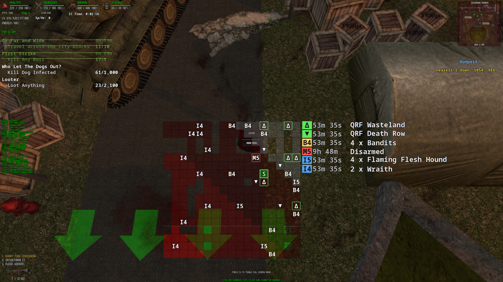

# df-hud

A HUD overlay for Dead Frontier on Windows and Linux (Wayland).

It sits on top of the game, fullscreen included, and clicks go through to the
client. It talks to the game's API and DFProfiler's event map. No screen
scraping, no OCR.

## Features

- [Block info](docs/widgets/block.md): region or outpost, and block support. Top right.
- [Bosses](docs/widgets/bosses.md): what is on your block, or the nearest event. In Onslaught this is last / now / next
- [Keybinds](docs/widgets/keybinds.md): the overlay hotkeys, one per line. Starts shown.
- [Run clock](docs/widgets/session.md): elapsed since the run started. It keeps ticking if you pause
- [XP/hr](docs/widgets/xp.md): a one-minute average
- [Challenge board](docs/widgets/challenges.md): the whole board, filtered by category
- [City map](docs/widgets/map.md): the inner city. Press a key to show it

Each group sits where you put it. The map starts hidden. The keybinds list
starts shown; hide it from the tray or with `enabled = false`.

## Keys

These only work while Dead Frontier is focused.

| Key | Action |
| --- | --- |
| `G` | City map |
| `Z` | Challenge board |
| `J` | Show or hide the overlay |
| `K` | Restart the run clock |
| `U` | Reset the XP/hr average |

Change them in `[hotkeys]`. An empty value turns that one off. The
[keybinds](docs/widgets/keybinds.md) group prints the live set on the overlay.
See [How to use](docs/usage.md).

## Install

Windows, or a Wayland compositor with layer-shell: Hyprland, KDE, Sway, niri,
COSMIC, and most others. GNOME, Cinnamon, and Weston do not have it. The
[install](docs/install.md) page lists the rest.

The built-in hotkeys need Hyprland; on any other compositor, bind your own keys
to the [loopback API](docs/manual-wiring.md) instead, which reaches every action
the keys do. The tray can turn the FPS overlay on at launch, and skip the
launcher dialog.

It is recommende to install
[DF HUD Bridge](https://greasyfork.org/en/scripts/592954-df-hud-bridge). That
is how df-hud gets your session: the script keeps it in sync, and the
challenge list needs it. If you skip the script, `df.user_id` still covers
everything except the board. Details are on [install](docs/install.md).

[Install](docs/install.md), [how to use](docs/usage.md),
[configuration](docs/configuration.md).

GPL-3.0-or-later. Notes on the game feeds are in [knowledge/](knowledge/).

## Development

Building it, or sending a patch? [Development](docs/development.md) has the
checks CI runs, and where LLMs fit in.

## Why was this made?

Inspired by SilverOverlays which I couldn't make work for Linux. At first I decided to build a Go application for Linux which I eventually ported to Windows as well, but it was a shitty first attempt and a pain to build, so here we are.

## LLM use

I used LLMs to help write this, on purpose. Everything in the tree still got
read and understood by a person. If nobody can explain a change, it doesn't
go in.

