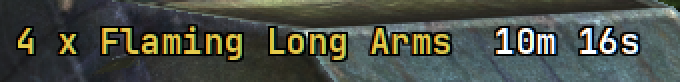
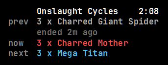

# Bosses

`[widget.bosses]`. What is on your block. Sits under [block info](block.md) on
the right.



One row per enemy type, plus **OUTPOST ATTACK** when every outpost is under
attack. Most blocks are empty, so this group is often blank.

When your own block is empty, it shows the nearest event instead:

```
nearest 4 up 1 left  1054, 1015
```

Up is north (`y` going down). Distance is walking distance around gaps, not a
straight line. If the walk is longer than the directions add up to, the row
says how many blocks:

```
nearest 3 up 1 left, 8 blocks  1015, 1024
```

Anything more than a dozen blocks away is left off. `show_nearest = false`
turns the row off.

In Onslaught this group becomes the cycle panel (prev, now, and next)
instead of the city list. The [city map](map.md) hides there. Onslaught is not
on that grid.



| Key | Default | |
| --- | --- | --- |
| `enabled` | `true` | On or off |
| `anchor` | `right` | `x` is an inset from `hud.reference_width` |
| `x`, `y` | `320`, `344` | 320px in from the right, under block info |
| `show_nearest` | `true` | Nearest event when this block is empty |

These rows are the longest thing the HUD draws. Leave room on the right. Lines
clip, they do not wrap.
