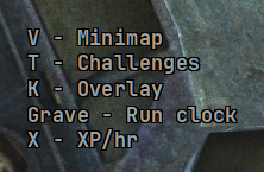

# Keybinds

`[widget.keybinds]`. A cheat sheet of the live `[hotkeys]` bindings, one per
line:

```
G - Minimap
Z - Challenges
J - Overlay
K - Run clock
U - XP/hr
```

The letters follow whatever is in the config. An empty binding is left off.



It sits on the right, under [block info](block.md) / [bosses](bosses.md), away
from the native XP and IC Time UI and away from the
[challenge board](challenges.md).

It starts **shown**. The [city map](map.md) is the group that starts hidden.
There is no hotkey for this list. Tray **Show keybinds** and
`POST /api/widget/keybinds/toggle` hide it until you restart. That is not
saved. `enabled = false` turns it off for good.

| Key | Default | |
| --- | --- | --- |
| `enabled` | `true` | On or off. Starts shown; hide is session-only. |
| `anchor` | `right` | `x` is an inset from `hud.reference_width` |
| `x`, `y` | `220`, `530` | 220px in from the right, below a full bosses nest |
| `color` | `#a0a0a0` | Mid grey, so it does not compete with the rest of the HUD |
