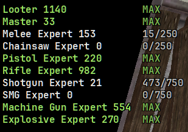

# Masteries

`[widget.masteries]`. Your mastery levels and progress to the next one, one
row each:

```
Melee Expert 48  512/750
Looter 204       37/103
```



**Off by default** (`enabled = false`): it is another authenticated request
stream, and most of the time only the masteries you are actively grinding are
interesting. You need the [Bridge script](../install.md#session-script) for
this one; `df.user_id` will not fill it.

A mastery is **mastered** when every bonus it grants has hit its cap. The
level keeps climbing but the boost cannot grow, so a mastered row shows `MAX`
in green instead of a progress fraction — and is hidden by default.

| Key | Default | What it covers |
| --- | --- | --- |
| `show_mastered` | `false` | Rows whose every bonus is at its cap. They never change again except as a bigger number next to the name. |
| `show_artisan` | `false` | Artisan only levels from outpost work (services sold, production cycles), so out in the city it is a row that never moves. |
| `pin` | `[]` | Watch specific masteries. With any names here, ONLY these show, and the two switches above are ignored for them. Case does not matter, and the weapon masteries' " Expert" suffix is optional: `pin = ["melee"]` pins Melee Expert. |

Valid pin names: Looter, Artisan, Master, and the weapon masteries Melee,
Chainsaw, Pistol, Shotgun, Rifle, SMG, Machine Gun, Explosive (each reported
by the game as "... Expert" in full). `df-hud --dump-masteries` prints yours
exactly, with the bonus values behind each row.

The tray is the quickest way in: while the widget is off in the config, the
item reads **Enable masteries widget** and clicking it writes
`[widget.masteries] enabled = true` into your config file (nothing else is
touched). Once enabled, the item becomes **Show masteries** and, like
`POST /api/widget/masteries/toggle`, toggles visibility for this run only.
df-hud never writes `enabled = false`; turning it back off is a config edit.
No hotkey by default.

| Key | Default | |
| --- | --- | --- |
| `enabled` | `false` | On or off. The poller only runs while this is on. |
| `x`, `y` | `10`, `900` | Position at 2560x1440 |
| `color` | `#e8e8e8` | Normal colour. Mastered rows go green. |
| `max_shown` | `0` | Row cap. `0` means no cap. |
| `poll.mastery_interval` | `30` | Cadence in seconds while playing; stretches to `poll.idle_interval` when the game is closed. Minimum 30. |
