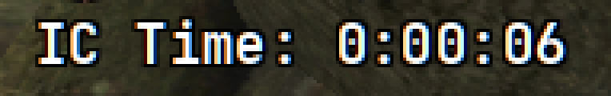

# Run clock

`[widget.session]`. Elapsed time since the run started.

It starts from Discord rich presence when that is fresh (a city block or an
outpost), or from the next poll that sees you leave an outpost or move. Either
can fire before or after you hit Start. After that it just counts. Pause, AFK,
and focus do not stop it. It stops if you die or the game closes (or
relaunches). Restarting df-hud mid-run keeps the same clock. The run is tied
to the game's process.

**K** (`hotkeys.run_start`) and the tray item **Restart run clock**
set it from now.

| Key | Default | |
| --- | --- | --- |
| `enabled` | `true` | On or off |
| `x`, `y` | `350`, `60` | Position at 2560x1440 |
| `prefix` | `"IC Time: "` | Text before the clock |
| `color` | `#ffffff` | Normal colour |
