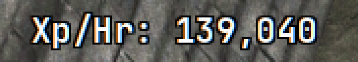

# XP/hr

`[widget.xp]`. Experience per hour from the last time cumulative XP moved.

A poll that repeats the same total is ignored. When the total changes, the
rate is that gain over the time since the previous change, scaled to an hour.
The rate stays blank until `min_samples` changes have landed (default 3).
After 300 seconds with no change, the next gain starts the count again.

Amber means a recent poll missed. Red means several have. Those colours win
over `color`. After a challenge reward dumps a lump into the last interval,
**U** (`hotkeys.xp_reset`) or the tray item **Reset xp/hr** starts it again.

`show_progress = true` prefixes the line with banked overflow past the current
level (`300%  Xp/Hr: …`) once `df_exp` is over the catalog threshold. At or
under 100% the prefix is omitted; the game sidebar already shows that. It
updates on each player-record poll (`poll.active_interval`, default 10
seconds). At the level cap, or if the catalog has not loaded, the prefix is
omitted.

| Key | Default | |
| --- | --- | --- |
| `enabled` | `true` | On or off |
| `x`, `y` | `220`, `80` | Position at 2560x1440 |
| `prefix` | `"Xp/Hr: "` | Text before the number |
| `show_progress` | `false` | Overflow `%` to the left of the prefix |
| `color` | `#ffffff` | Normal colour. Amber and red still win. |
| `window` | `60` | Unused for the rate; kept so existing configs still parse |
| `min_samples` | `3` | Changes before a rate is shown |
